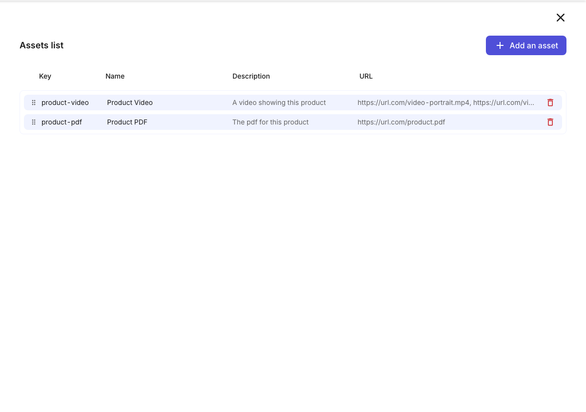
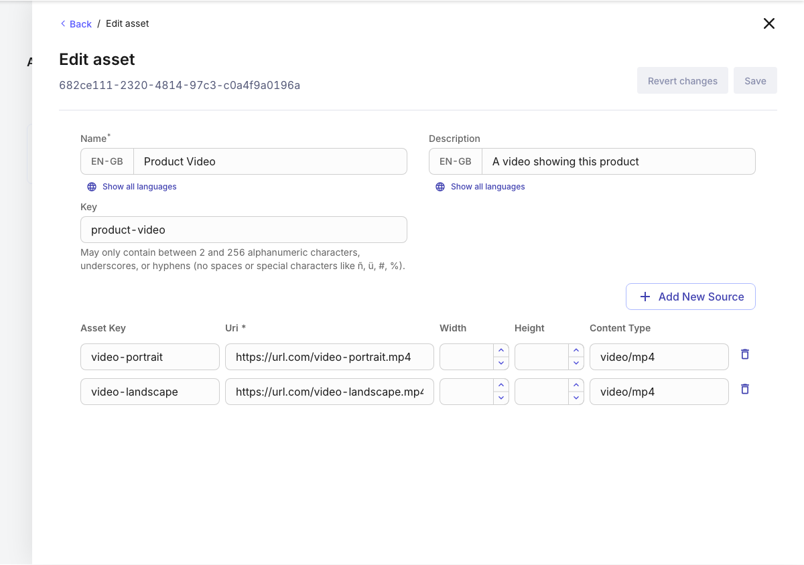
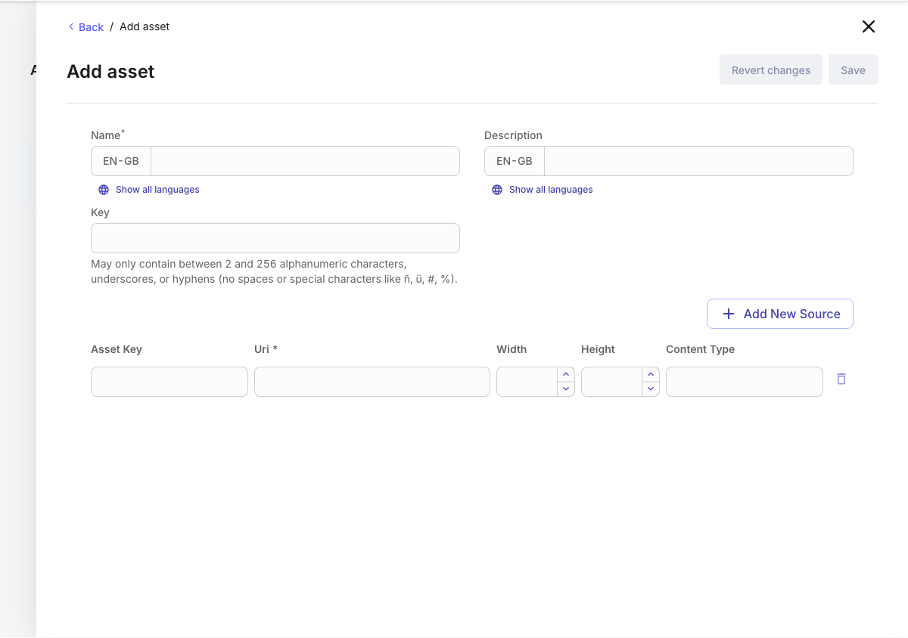

<p align="center">
  <a href="https://commercetools.com/">
    
  </a></br>
  <b>Asset Manager</b>
</p>

***NOTE***: This is NOT an official commercetools code and NOT production ready. Use it at your own risk.

A Merchant Center [Custom View](https://docs.commercetools.com/merchant-center-customizations/custom-views) to manage [Assets](https://docs.commercetools.com/api/types#asset) on Product Variants and Categories, right from their detail pages.

## Current Feature Set

The Custom View opens as a panel on these pages:

- Product Variant details: **General** and **Images** tabs
- Category details: **General** tab

In the panel you can:

1. See all Assets of the current Product Variant or Category with their key, name, description and source URLs.
2. **Reorder** Assets by dragging a row; the new order is saved on drop.
3. **Add** an Asset with a localized name and description, an optional key, and one or more sources (URI, key, dimensions, content type).
4. **Edit** an Asset by clicking its row.
5. **Delete** an Asset with the delete button in its row.

Product changes are applied to the current (published) Product data (`staged: false`).

The UI is available in English and German and follows the Merchant Center user's language. Messages live in [asset-manager/src/i18n/data](./asset-manager/src/i18n/data): run `npm run extract-intl` to refresh `core.json` after adding or changing messages, then update `en.json` and `de.json`.

## Local Development

Requirements: Node.js 22 (see [.nvmrc](./asset-manager/.nvmrc)) and npm.

1. Create `asset-manager/.env.local` with your environment:

   ```shell
   CLOUD_IDENTIFIER=gcp-eu
   INITIAL_PROJECT_KEY=<your-project-key>
   CUSTOM_VIEW_ID=<your-custom-view-id>
   APPLICATION_URL=<your-deployed-application-url>
   ```

2. Point the `development` section of [custom-view-config.mjs](./asset-manager/custom-view-config.mjs) at a Product Variant (or Category) in that project:

   ```js
   development: {
     initialProjectKey: '${env:INITIAL_PROJECT_KEY}',
     hostUriPath: '/<project-key>/products/<product-id>/variants/1/images',
     // hostUriPath: '/<project-key>/categories/<category-id>/general',
   },
   ```

   The `hostUriPath` is the page the panel is opened from. Read more [here](https://docs.commercetools.com/merchant-center-customizations/api-reference/custom-view-config#envdevelopmenthosturipath).
   The project key in the path must match `INITIAL_PROJECT_KEY`, otherwise the panel shows a "not found" message.

3. Install and start:

   ```shell
   cd asset-manager
   npm install
   npm start
   ```

   Open [http://localhost:3001](http://localhost:3001), log in, and click **Open the Custom View**.

### Scripts

| Command | Description |
| --- | --- |
| `npm start` | Start the development server |
| `npm run build` | Production build |
| `npm run typecheck` | TypeScript check |
| `npm run lint` | ESLint (flat config, including GraphQL documents) |
| `npm test` | Jest tests |
| `npm run generate-types:ctp` | Log into the Merchant Center and regenerate `schemas/ctp.json` and `src/types/generated/ctp.ts` |
| `npm run generate-types:chakra` | Regenerate Chakra types for Nimbus (runs automatically on `npm install`) |

## Tech Stack

- UI built with Nimbus (`@commercetools/nimbus`), the commercetools design system. See [NIMBUS_MIGRATION.md](./asset-manager/NIMBUS_MIGRATION.md) for notes and pitfalls.
- Data access via the Merchant Center GraphQL API (`useMcQuery`/`useMcMutation`), with documents in `src/hooks/use-product-connector` and `src/hooks/use-category-connector`.
- Update actions are calculated with [`@commercetools/sync-actions`](https://www.npmjs.com/package/@commercetools/sync-actions).

## Deployment

The repository is set up as a commercetools [Connect](https://docs.commercetools.com/connect) application of type `merchant-center-custom-view` (see [connect.yaml](./connect.yaml)). When deploying, provide:

- `CUSTOM_VIEW_ID`: the Custom View ID shown when you register the Custom View in the Merchant Center
- `CLOUD_IDENTIFIER`: one of `gcp-us`, `gcp-eu`, `aws-us`, `aws-eu` (default `gcp-eu`)

Pushing a tag runs the [tag-push workflow](./.github/workflows/tag-push-workflow.yml), which points the Connect draft at that tag and marks it previewable.

## Screenshots





The screenshots are generated with Playwright, see [scripts/screenshots](./asset-manager/scripts/screenshots/README.md).
